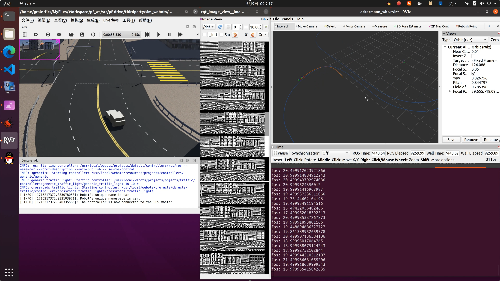
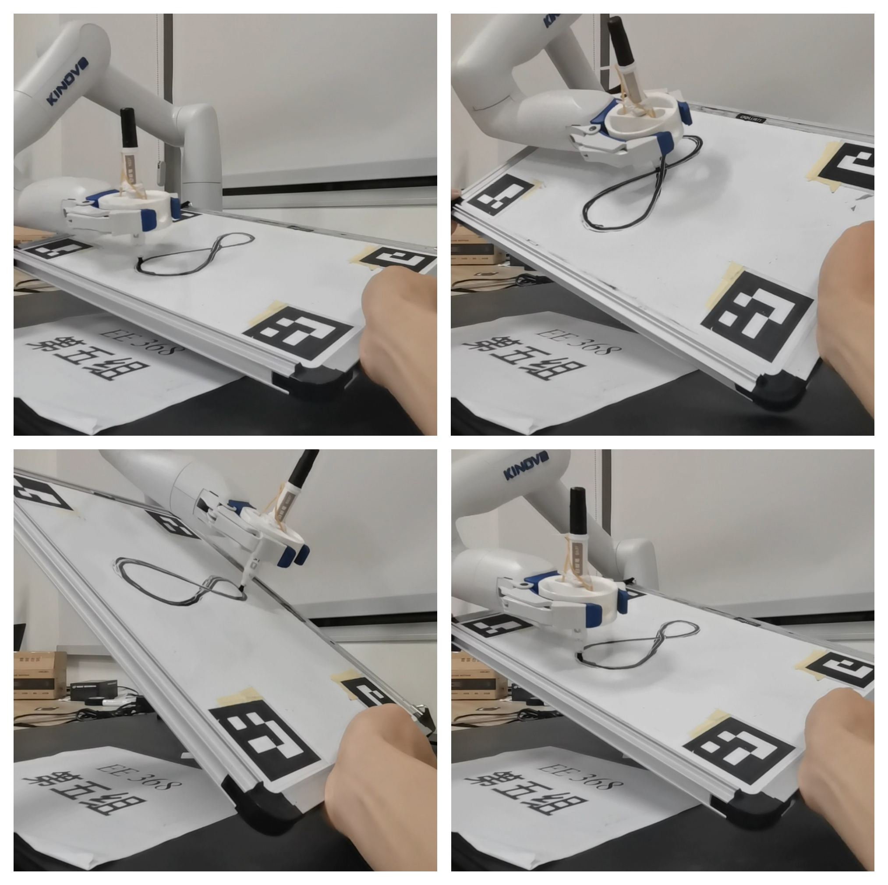
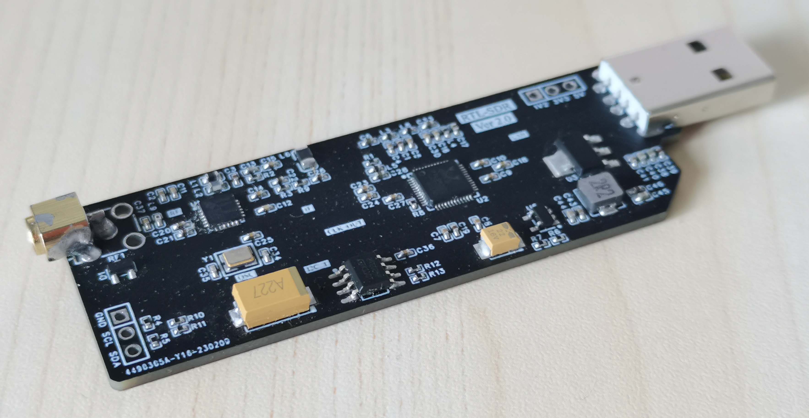
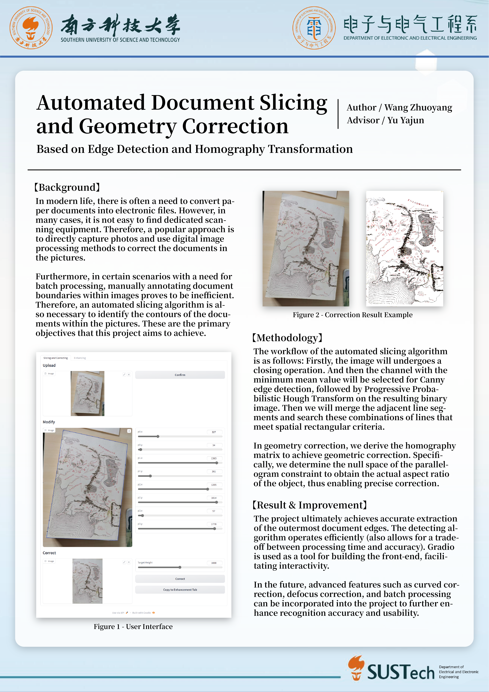

# My-Collection-of-Works
一些相对完整的项目、课程设计仓库索引。

## 项目
### FmcPGA
Repo: [Gralerfics/FmcPGA](https://github.com/Gralerfics/FmcPGA)

使用硬件描述语言 VHDL 编写，使用光线步进和流水线设计，运行在 FPGA 上的丐版 Minecraft。支持 PS2 手柄控制移动、放置和破坏方块。

    

### ZeptoWatch  
Repo: [Gralerfics/ZeptoWatch](https://github.com/Gralerfics/ZeptoWatch)

使用 STM32 制作的电子手表。

硬件设计包含电容触摸屏、加速度计、蓝牙、振动马达、EEPROM、RTC 等外设。

固件设计支持 FreeRTOS、USB2.0、FAT 文件系统、LVGL 图形界面；同时内嵌 Python 解释器，可执行用户存储的脚本，作为应用程序，并将外设接口和 UI 接口封装为包供开发者调用。

    

### OthellooO
Repo: [Gralerfics/OthellooO](https://github.com/Gralerfics/OthellooO)

使用 Java、Swing 与 LWJGL 框架实现的三维黑白棋（翻转棋）游戏。除游戏主逻辑外包括存档管理、玩家管理、人机对战、悔棋、回放、个性化主题色等功能。

图形框架使用 LWJGL，在片段着色器中实现光线追踪、PBR 材质、Hdr 背景，以及八叉树、重要性采样等优化。

    

### 基于示教的摆渡车自动驾驶系统 (Temporarily Private)
Repo: [Gralerfics/pf-drive](https://github.com/Gralerfics/pf-drive)

以 *Fast and Robust Bio-inspired Teach and Repeat Navigation* 中的方法作为 baseline，扩展至实车大小的阿克曼结构平台上，实现稳定的路线重复行驶，并进一步构建完整的具有记录、重复、聚合、避障等功能的驾驶系统，乃至多车系统。

仍在进行中。

    

### 机器人导航与控制相关课程任务
Repos:

[Gralerfics/SUSTech-EE211-Robotic-Perception-and-Intelligence-Laboratory](https://github.com/Gralerfics/SUSTech-EE211-Robotic-Perception-and-Intelligence-Laboratory)

该课程项目要求完成在障碍场景下的多点导航，以及一个贴有二维码物块的抓取与搬运。

    

[Gralerfics/SUSTech-EE346-Mobile-Robot-Navigation-and-Control-Laboratory](https://github.com/Gralerfics/SUSTech-EE346-Mobile-Robot-Navigation-and-Control-Laboratory)

该课程项目要求完成在障碍场景下的多点导航，并在途中停靠多处位置不确定的标记物。

    

[Gralerfics/SUSTech-EE368-Robotic-Motion-and-Control-Project](https://github.com/Gralerfics/SUSTech-EE368-Robotic-Motion-and-Control-Project)

该项目通过识别白板上的二维码，可以跟随慢速移动的白板，在其上绘制图案。

    

### 原生 HTTP 服务器及文件管理器
Repo: [Gralerfics/http_file_manager](https://github.com/Gralerfics/http_file_manager)

基于 Python，不使用现有框架开发的 HTTP 服务端，以及一个文件管理器应用。

前者实现基本的 HTTP 1.1 协议，支持 GET、POST、HEAD 请求，以及一个简易的加密通信框架；后者包含完整前后端应用，支持用户登录、文件上传、下载、删除、重命名、新建文件夹、查看文件内容等功能。

    

### RTL-SDR 硬件设计与制作
Repo: [Gralerfics/RTL-SDR-Project](https://github.com/Gralerfics/RTL-SDR-Project)

参考 RTL-SDR 经典结构，设计并制作 RTL-SDR，一款低成本软件定义无线电接收器，并成功接收到 FM 电台信号。

仓库内包括硬件设计源文件、工具软件，以及包含设计方案、原理说明、驱动程序分析等内容的教程文档。

    

## 其它项目及课程设计
### EE332 数字系统设计
Lab: [Gralerfics/SUSTech-EE332-Digital-System-Design-Laboratory](https://github.com/Gralerfics/SUSTech-EE332-Digital-System-Designing-Laboratory)

Project: 见上 FmcPGA

### EE201-17L 模拟电路实验
Project: 见上 ZeptoWatch

### CS305 计算机网络
Project: 见上 http_file_manager

### CS102A 计算机程序设计基础 A (Java)
Project: 见上 OthellooO

### EE323 数字信号处理
Mini Project: [Gralerfics/Simple-Music-Synthesizer](https://github.com/Gralerfics/Simple-Music-Synthesizer)

使用 MATLAB 实现的简易合成器，通过记录包络与谐波信息，可以模拟较真实的钢琴音色。

### EE208 工程电磁场理论
Lab: [Gralerfics/SUSTech-EE208-Engineering-Electromagnetic-Theory-Laboratory](https://github.com/Gralerfics/SUSTech-EE208-Engineering-Electromagnetic-Theory-Laboratory)

### EE211 机器人感知与智能
Lab & Project: 见上 SUSTech-EE211-Robotic-Perception-and-Intelligence-Laboratory

### EE346 移动机器人导航与控制
Lab: 见上 SUSTech-EE346-Mobile-Robot-Navigation-and-Control-Laboratory

### EE368 机器人运动与控制方法
Project: 见上 SUSTech-EE368-Robotic-Motion-and-Control-Project

### EE326 数字图像处理
Lab: [Gralerfics/SUSTech-EE326-Digital-Image-Processing-Laboratory](https://github.com/Gralerfics/SUSTech-EE326-Digital-Image-Processing-Laboratory)

Project: [Gralerfics/SUSTech-EE326-Digital-Image-Processing-Project](https://github.com/Gralerfics/SUSTech-EE326-Digital-Image-Processing-Project)

矩形区域分割、几何校正与图像增强。

    

### EE205 信号和系统
Lab & Project: [Gralerfics/SUSTech-EE205-Signals-and-Systems-Lab](https://github.com/Gralerfics/SUSTech-EE205-Signals-and-Systems-Lab)

Tool: [Gralerfics/Signal-Processing-Assistant](https://github.com/Gralerfics/Signal-Processing-Assistant)

### EE317 电子科学创新实验 I
Android Project 1: [Gralerfics/Gralculator](https://github.com/Gralerfics/Gralculator)

Android Project 2: [Gralerfics/Gralayer](https://github.com/Gralerfics/Gralayer)

STM32 Project Template: [STM32F103VET6-StdPeriph-Driver-Template-For-CLion](https://github.com/Gralerfics/STM32F103VET6-StdPeriph-Driver-Template-For-CLion)

STM32 Encapsulation (Deserted): [Gralerfics/STM32-Simple-Abstraction-Layer](https://github.com/Gralerfics/STM32-Simple-Abstraction-Layer)

### EE202-17L 数字电路实验
Project: [Gralerfics/FPongGA](https://github.com/Gralerfics/FPongGA)

