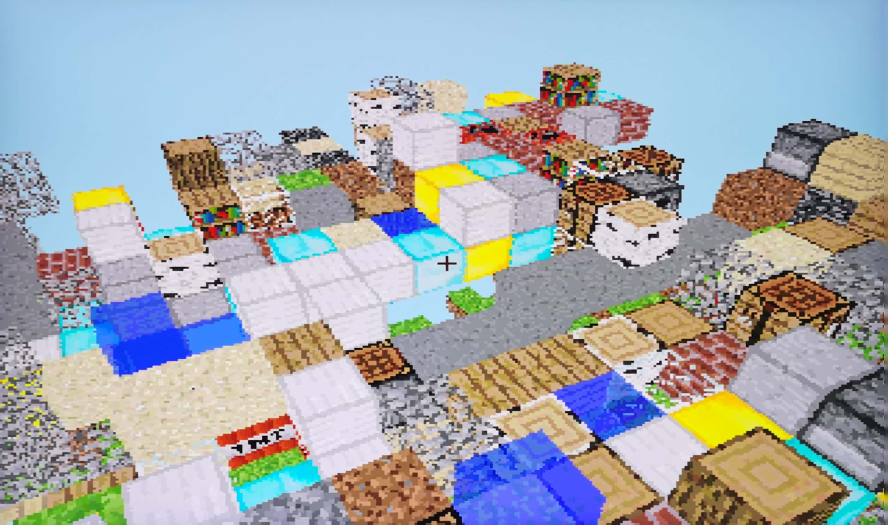
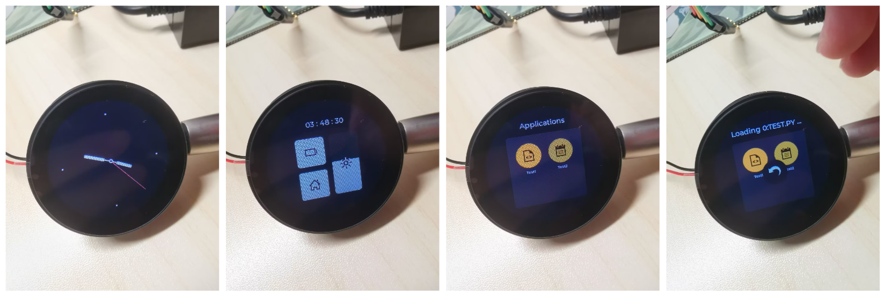
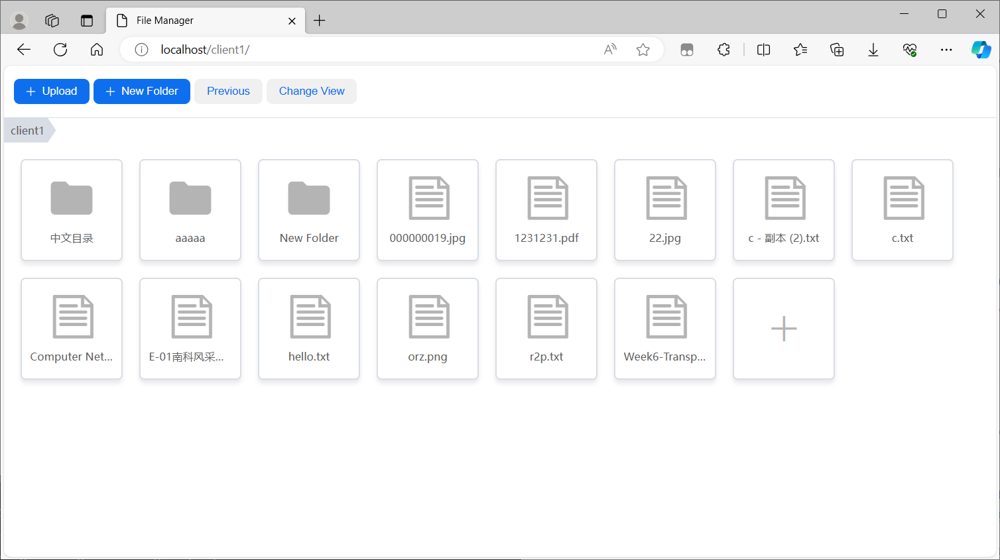
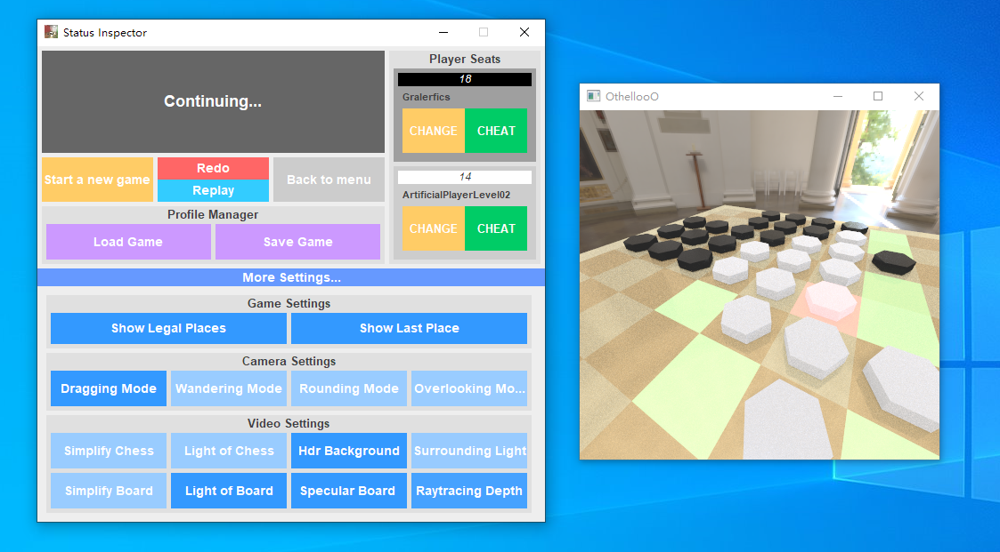

# My-SUSTech-Course-Repos
一些相对完整的课程实验、项目仓库索引，按个人满意度排序（大概？）。

## EE332 数字系统设计
Lab: [Gralerfics/SUSTech-EE332-Digital-System-Design-Laboratory](https://github.com/Gralerfics/SUSTech-EE332-Digital-System-Designing-Laboratory)

Project: [Gralerfics/FmcPGA](https://github.com/Gralerfics/FmcPGA)

## EE201-17L 模拟电路实验
Project: [Gralerfics/ZeptoWatch](https://github.com/Gralerfics/ZeptoWatch)

## CS305 计算机网络
Project: [Gralerfics/http_file_manager](https://github.com/Gralerfics/http_file_manager)

## CS102A 计算机程序设计基础 A (Java)
Project: [Gralerfics/OthellooO](https://github.com/Gralerfics/OthellooO)

## EE208 工程电磁场理论
Lab: [Gralerfics/SUSTech-EE208-Engineering-Electromagnetic-Theory-Laboratory](https://github.com/Gralerfics/SUSTech-EE208-Engineering-Electromagnetic-Theory-Laboratory)

## EE211 机器人感知与智能
Lab & Project: [Gralerfics/SUSTech-EE211-Robotic-Perception-and-Intelligence-Laboratory](https://github.com/Gralerfics/SUSTech-EE211-Robotic-Perception-and-Intelligence-Laboratory)

## EE323 数字信号处理
Mini Project: [Gralerfics/Simple-Music-Synthesizer](https://github.com/Gralerfics/Simple-Music-Synthesizer)

## EE326 数字图像处理
Lab: [Gralerfics/SUSTech-EE326-Digital-Image-Processing-Laboratory](https://github.com/Gralerfics/SUSTech-EE326-Digital-Image-Processing-Laboratory)

Lab: [Gralerfics/SUSTech-EE326-Digital-Image-Processing-Project](https://github.com/Gralerfics/SUSTech-EE326-Digital-Image-Processing-Project)

## EE346 移动机器人导航与控制
Lab: [Gralerfics/SUSTech-EE346-Mobile-Robot-Navigation-and-Control-Laboratory](https://github.com/Gralerfics/SUSTech-EE346-Mobile-Robot-Navigation-and-Control-Laboratory)

## EE368 机器人运动与控制方法
Project: [Gralerfics/SUSTech-EE368-Robotic-Motion-and-Control-Project](https://github.com/Gralerfics/SUSTech-EE368-Robotic-Motion-and-Control-Project)

## EE205 信号和系统
Lab & Project: [Gralerfics/SUSTech-EE205-Signals-and-Systems-Lab](https://github.com/Gralerfics/SUSTech-EE205-Signals-and-Systems-Lab)

Tool: [Gralerfics/Signal-Processing-Assistant](https://github.com/Gralerfics/Signal-Processing-Assistant)

## EE317 电子科学创新实验 I
Android Project 1: [Gralerfics/Gralculator](https://github.com/Gralerfics/Gralculator)

Android Project 2: [Gralerfics/Gralayer](https://github.com/Gralerfics/Gralayer)

STM32 Project Template: [STM32F103VET6-StdPeriph-Driver-Template-For-CLion](https://github.com/Gralerfics/STM32F103VET6-StdPeriph-Driver-Template-For-CLion)

STM32 Encapsulation (Deserted): [Gralerfics/STM32-Simple-Abstraction-Layer](https://github.com/Gralerfics/STM32-Simple-Abstraction-Layer)

## EE202-17L 数字电路实验
Project: [Gralerfics/FPongGA](https://github.com/Gralerfics/FPongGA)

